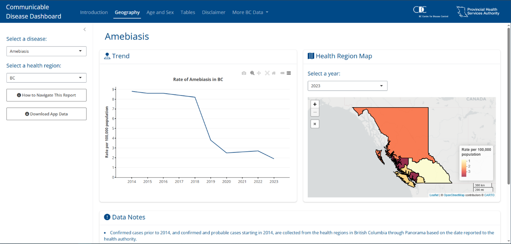
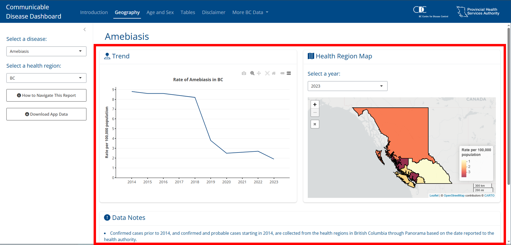
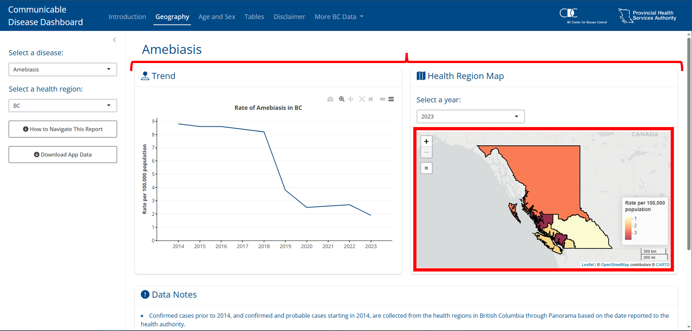

# bslib

The `bslib` R package provides a modern UI toolkit that builds on the `shiny` package. In summary, `bslib` facilitates:

- Creation of delightful and customizable Shiny dashboards.   
- UI components (e.g., cards, value boxes, sidebars, etc).   
- Custom theming of Shiny apps.   

```{r eval=F}
install.packages("bslib")
```

```{r echo=F,fig.cap="Example of a bslib dashboard"}
knitr::include_graphics("images/bslib_ex.png")
```

## Fundamentals

### Pages {#pages}

One of the core features of `bslib` is the use of pages/tabs. To build an app this way `bslib` makes it easy by using the `bslib::page_navbar()` function to create child tabs with `bslib::nav_panel()`. Additionally, `bslib` apps tend to rely on sidebars so many functions, including `bslib::page_navbar()`, have a built in `sidebar` argument that you can fill using `bslib::sidebar()`.

```{r echo=F,fig.cap="Example of a bslib dashboard with a page layout."}

```

### Cards {#cards-intro}

Another core feature of `bslib` apps is the `card()`. Apps built using `bslib` will almost always use cards, these are essentially containers that hold content in an organized way that make it really easy for users to engage, understand, and navigate your app. 

```{r echo=F,fig.cap="Example of a bslib dashboard cards."}

```

### Content filling {#filling}

The last core concept to `bslib` is the way it is geared towards a filling layout, which means that contents are encouraged to grow/shrink to fit the browser window so that regardless of the resolution you're accessing the app it will adjust to fill it nicely. As a result, many functions have a `fill` argument; these are considered "fillable" containers. The child contents, a child in this case means it is wrapped by the parent function, will fill the parent feature when `fill = TRUE`, which is the default. When content goes beyond the screen resolution `bslib` will make the content scrollable.   

There is a lot to filling and it's fundamental to `bslib` so it is recommended to read more about it [here](https://rstudio.github.io/bslib/articles/filling/index.html).   

```{r echo=F,fig.cap="Example of a plot filling a card and cards filling a page."}

```


## Layouts

### Multi-page

To create multiple pages (or tabs) you can use `bslib::page_navbar()`, where you can set the `sidebar` argument if you want a sidebar, as well as add pages (tabs) by calling `bslib::nav_panel()`. Beyond a sidebar and tabs you can also create additional space between elements on the tab bar using `bslib::nav_spacer()` and even add links using `bslib::nav_item()`.

``` {r eval=F}
#A typical setup
bslib::page_navbar(
  title = "Interesting title",
  sidebar = bslib::sidebar(),
  bslib::nav_spacer(),
  bslib::nav_panel(
    "Tab 1", 
    bslib::card()
  ),
  bslib::nav_panel(
    "Tab 2", 
    bslib::card()
  ),
  bslib::nav_panel(
    "Tab 3", 
    bslib::card()
  ),
  bslib::nav_item(
    htmltools::tags$a(
      "Title", 
      href = "https://myurl.com"
    )
  )
)
```

[Read more!](https://rstudio.github.io/bslib/articles/dashboards/index.html#multi-page)


::::{.tipbox}
:::{.center}
**TIP**
:::
Most of the apps you will build will likely be structured something like the above as `bslib::page_navbar()` is one of the primary functions for building apps, especially at the BCCDC.
::::

### Multi-panel {#multi-panel}

Not only can we use tabs at the page level using `bslib::page_sidebar()`, we can also create them using any `bslib::navset_*()`. These are built to be outside the context of cards, but there are also some that create tabbed cards following the format of `bslib::navset_card_*()`. Check all of the options [here](https://rstudio.github.io/bslib/reference/navset.html#details).

[Read more!](https://rstudio.github.io/bslib/articles/dashboards/index.html#multi-panel)

::::{.notebox}
:::{.center}
**NOTE**
:::
Personally, the most useful feature set from this is the use of tabs for cards using `bslib::navset_card_*()`.
::::

### Scrolling vs filling

Both `bslib::page_sidebar()` and `bslib::page_navbar()` default to a filling layout (see Section \@ref(filling)). Sometimes this results in undesireable behaviour, you can combat this by setting `bslib::card()` heights using `min_height` to restrict how small a card gets or `max_height` to restrict how large a card will get:

``` {r eval=F}
bslib::page_sidebar(
  title = "Title",
  bslib::sidebar = bslib::sidebar(),
  bslib::card(
    min_height = 200
  ),
  bslib::card(
    max_height = 200
  )
)
```

Even further, you may not want the filling layout at all. To stop this you can set `fill = FALSE` which will default outputs to 400px (or whatever height you have specified) and will make the whole page scrollable instead:

``` {r eval=F}
bslib::page_sidebar(
  title = "Penguins dashboard",
  bslib::sidebar = bslib::sidebar(),
  fillable = FALSE,
  bslib::card()
)
```

[Read more!](https://rstudio.github.io/bslib/articles/dashboards/index.html#scrolling-vs-filling)


### Multi-column

#### `bslib::layout_columns()`

Create column layouts easily using `bslib::layout_columns()`. Optional arguments include:

- `col_widths` which go up to 12 for each row. Beyond 12 cards will wrap to the next row. Negative values create an empty space. If not specified widths will be equally split.
- `row_heights` Numeric inputs are fractional units but fixed units are supported too. If not specified widths will be equal.

``` {r eval=F}
ui <- bslib::page_sidebar(
  bslib::layout_columns(
    col_widths = c(4, 8, -2, 8, -2),
    row_heights = c(1, 2),
    bslib::card(),
    bslib::card(),
    bslib::card()
  )
)
```

```{r echo=F,fig.cap="Example of bslib::layout_columns()"}
knitr::include_graphics("images/layout_columns.png")
```

[Read more!](https://rstudio.github.io/bslib/articles/dashboards/index.html#multi-column)

#### `bslib::layout_column_wrap()` {#col-wrap}

When displaying multiple cards (or value boxes, etc) at once, it’s often most visually appealing to have them displayed in a grid-like layout where each card has the same height and width. This is the core principle of `bslib::layout_column_wrap()`, instead of specifying every column's width and every row's height like `bslib::layout_columns()`, we will give a width and height to apply to every card.

[Read more!](https://rstudio.github.io/bslib/articles/column-layout/index.html)

##### Fixed columns {.unnumbered}

Provide the width as `width = 1/n` where `n` is the number of columns. Columns will adjust to the window size to maintain the 1/n width:

``` {r eval=F}
bslib::layout_column_wrap(
  width = 1/2, 
  height = 300,
  bslib::card(),
  bslib::card(),
  bslib::card()
)
```

[Read more!](https://rstudio.github.io/bslib/articles/column-layout/index.html#fixed-number-of-columns)

##### Responsive number of columns {.unnumbered}

Provide the width in any valid CSS unit like `200px`. In this case, a two card layout will wrap to a new row when the window is less than 400 pixels wide (200px * 2 cards); beyond 400 pixels the cards will widen to equally fill the space:

``` {r eval=F}
bslib::layout_column_wrap(
  width = '200px', 
  height = 300,
  bslib::card(),
  bslib::card(),
  bslib::card()
)
```

[Read more!](https://rstudio.github.io/bslib/articles/column-layout/index.html#responsive-number-of-columns)

##### Fixed column width {.unnumbered}

If you don't want cards to fill the free space if the window goes beyond the total width of your cards then set the argument `fixed_width = TRUE`:

``` {r eval=F}
bslib::layout_column_wrap(
  width = '200px', 
  height = 300,
  fixed_width = TRUE,
  bslib::card(),
  bslib::card(),
  bslib::card()
)
```

[Read more!](https://rstudio.github.io/bslib/articles/column-layout/index.html#fixed-column-width)

##### Varying heights by row {.unnumbered}

The default is to have all row heights equal. However, you can also allow row heights to be different set `heights_equal = "row"`:

``` {r eval=F}
bslib::layout_column_wrap(
  width = "200px",
  heights_equal = "row",
  bslib::card(),
  bslib::card(),
  bslib::card()
)
```

[Read more!](https://rstudio.github.io/bslib/articles/column-layout/index.html#by-row)

##### Varying heights by cell {.unnumbered}

Cards are considered 'fill items', which means they will adapt to fill space by default. This means that if one card has less content than the other cards in the row, it will still expand to fill that empty space. However, you can prevent this by specifying `fill = FALSE` in specific cards:

``` {r eval=F}
bslib::layout_column_wrap(
  width = "200px",
  bslib::card(),
  bslib::card(),
  bslib::card(
    fill = FALSE, #Here it is!!!
    card_header("Nothing much here"),
    "This is it."
  )
)
```

[Read more!](https://rstudio.github.io/bslib/articles/column-layout/index.html#by-cell)

##### Varying widths {.unnumbered}

If you still want specific cards to have different widths but you want the functionality of wrapping, you can set the `width` to `NULL` and provide a custom css grid layout like so:

``` {r eval=F}
bslib::layout_column_wrap(
  width = NULL, 
  height = 300, 
  fill = FALSE,
  style = css(grid_template_columns = "2fr 1fr 2fr"), #second card has half the width as the other two
  bslib::card(),
  bslib::card(),
  bslib::card()
)
```

[Read more!](https://rstudio.github.io/bslib/articles/column-layout/index.html#varying-widths)

##### Nested layouts {.unnumbered}

You can also nest `layout_column_wrap()` within another `layout_column_wrap()` to create unique layouts. For example:

``` {r eval=F}
bslib::layout_column_wrap(
  width = 1/2,
  height = 300,
  bslib::card(),
  bslib::layout_column_wrap(
    width = 1,
    heights_equal = "row",
  bslib::bslib::card(),
  bslib::bslib::card()
  )
)
```

[Read more!](https://rstudio.github.io/bslib/articles/column-layout/index.html#nested-layouts)

::::{.notebox}
:::{.center}
**NOTE**
:::
In terms of formatting `bslib::layout_column_wrap()` is easier and provides a clean uniform look. It is likely that you will use this over `bslib::layout_columns()` in most cases.
::::

### Mobile layout

Filling layout for mobile devices is defaulted to `FALSE`. You can enable it by setting `fillable_mobile = TRUE` at the page level. You will want to set `min_height` for cards to prevent too much shrinkage.

[Read more!](https://rstudio.github.io/bslib/articles/dashboards/index.html#mobile-layout)

## Cards

A `bslib::card()` is designed to handle any number of “known” card items (e.g., `card_header()`, `card_body()`, etc) as unnamed arguments (i.e., children). As we’ll see shortly, `card()` also has some useful named arguments (e.g., `full_screen`, `height`, etc).

[Read more!](https://rstudio.github.io/bslib/articles/cards/index.html)

### Card components

- `bslib::card_header()`: is where you can place contents in a header. This is a great place for your title and any icons!    
- `bslib::card_body()`: is where you can place your main card contents. If you find yourself using `bslib::card_body()` without changing any of its defaults, consider dropping it altogether since it will be wrapped together into an implicit `card_body()` call anyways.    
- `bslib::card_footer()`: is where you can place contents in a footer. This is a great place for any tooltips or popovers (see section \@ref(tips-popovers)).    

### Restricting growth

By default, a `card()`’s size grows to accommodate the size of its contents. Thus, if a `card_body()` contains a large amount of text, tables, etc., you may want to specify a `height` or `max_height` so it doesn't get too large. If the contents go beyond the `max_height` the card will become scrollable. 

[Read more!](https://rstudio.github.io/bslib/articles/cards/index.html#restricting-growth)

::::{.tipbox}
:::{.center}
**TIP**
:::
These things can be finnicky, you really need to feel it out for yourself and do a lot of testing. Also, setting the `height` helps with formatting on mobile, otherwise things can get a bit squishy.
::::

### Scrolling

Although scrolling is convenient for reducing the amount of space required to park lots of content, it can also be a nuisance to the user. When the contents of a card go beyond the height of the screen `bslib` will automatically create a scroll bar for the card. To help reduce the need for scrolling, consider pairing scrolling with `full_screen = TRUE` (which adds an icon to expand the card’s size to the browser window). Additionally, set the parent to `fill = FALSE` and the whole page will become scrollable, where you can then set the card `height` argument so that the content fits within the card without the need for scrolling.

[Read more!](https://rstudio.github.io/bslib/articles/cards/index.html#restricting-growth)

::::{.tipbox}
:::{.center}
**TIP**
:::
Scrolling in cards can get a bit weird depending on the content. I'd recommend always having `full_screen = TRUE` and comparing how scrolling the card feels compared to scrolling the page. Remember, this can differ between pages/tabs!
::::

### Filling outputs

A `card()`’s default behavior is optimized for facilitating filling layouts. More specifically, if a fill item (e.g., plotly_widget), appears as a direct child of a `card_body()`, it resizes to fit the `card()`s specified height

Fill item(s) aren’t limited in how much they grow and shrink, which can be problematic when a card becomes very small. To work around this, consider adding a `min_height` or `height` on the `card_body()` container or alternatively turn `fill` to `FALSE` in the cards parent container (ie. `layout_column_wrap()`). Setting `fill` to `FALSE` will make the page scrollable and therefore won't force the cards to adjust to the screen size, meaning you can set the card height to fit the content into the card without the need for scrolling.

[Read more!](https://rstudio.github.io/bslib/articles/cards/index.html#filling-outputs)

``` {r eval=F}
card(
  height = 300,
  style = "resize:vertical;",
  card_header("Plots that grow but don't shrink"),
  card_body(
    min_height = 250,
    plotly_widget,
    plotly_widget
  )
)
```

### Other features

There is a ton of functionality for cards that we don't necessarily need to dive deep on. These include:

- **Multiple card bodies:** You can also set up a card with multiple card bodies, which is useful for when you want a fillable item with a non fillable item or to have unique stylings. [Read more!](https://rstudio.github.io/bslib/articles/cards/index.html#multiple-card_body)   
- **Multiple columns:** Sometimes you may want multiple columns in your card, for this you can use `bslib::layout_column_wrap()` within a card body to format the layout of your outputs. [Read more!](https://rstudio.github.io/bslib/articles/cards/index.html#multiple-columns)   
- **Multiple cards:** Again, as discussed in section \@ref(col-wrap) using `bslib::layout_column_wrap()` can also help format the layout of multiple cards. [Read more!](https://rstudio.github.io/bslib/articles/cards/index.html#multiple-cards)   
- **Multiple tabs:** We have already discussed tabs in section \@ref(multi-panel), these can be useful within cards themselves. [Read more!](https://rstudio.github.io/bslib/articles/cards/index.html#multiple-tabs)   
- **Sidebars:** You can also create sidebars within a card using `bslib::layout_sidebar()`. [Read more!](https://rstudio.github.io/bslib/articles/dashboards/index.html#cards-with-sidebars) and [Read even more!](https://rstudio.github.io/bslib/articles/cards/index.html#sidebars)   
- **Static images:** You can also embed static images! [Read more!](https://rstudio.github.io/bslib/articles/cards/index.html#static-images)   
- **Flexbox:** Cards are all fillable because they are CSS flexbox containers. This means when you have inline tags (html tags) there is weird behaviour where each tag will appear on a new line. However, if you set `fill = FALSE` they will render inline. [Read more!](https://rstudio.github.io/bslib/articles/cards/index.html#flexbox)   

## Sidebars

### Floating layout

Easily create a floating layout with a sidebar using `bslib::layout_sidebar()`. This will align nicely with the main contents or can even be placed inside cards.

``` {r eval=F}
bslib::layout_sidebar(
  sidebar = sidebar("Sidebar"),
  "Main contents"
)
```

[Read more!](https://rstudio.github.io/bslib/articles/sidebars/index.html#floating-layout)

### Filling layout

If you prefer to have a sidebar that extends the whole length of the page then make sure you nest your `bslib::layout_sidebar()` inside of a `bslib::page_fillage()` function.

``` {r eval=F}
bslib::page_fillable(
  bslib::layout_sidebar(
    sidebar = sidebar("Sidebar area"),
    "Main area"
  )
)
```

[Read more!](https://rstudio.github.io/bslib/articles/sidebars/index.html#filling-layout)

### Multi-page layout

If you want to use a single sidebar for multiple pages of an app you want to use the `sidebar` argument that is found in `bslib::page_navbar()` or `bslib::navset_card_tab()`.

``` {r eval=F}
bslib::page_navbar(
  sidebar = bslib::sidebar("Sidebar"),
  nav_panel("Page 1", "Page 1 content"),
  nav_panel("Page 2", "Page 2 content")
)
```

[Read more!](https://rstudio.github.io/bslib/articles/sidebars/index.html#multi-page-layout)

::::{.tipbox}
:::{.center}
**TIP**
:::
This is one of the best options for setting up a sidebar as it is built in with the `bslib::page_navbar()` which you will likely be building your app with anyways!
::::

### Conditional and reactive updates

Sometimes we want to have conditional contents in the sidebar that are based on the page/tab that has been selected. We can use `bslib::conditionalPanel()` inside of the `sidebar` argument in `bslib::page_navbar()`/`bslib::navset_card_tab()`/`navset_tab_pill()`. We just have to provide an `id` that we can reference in the `bslib::conditionalPanel()`: 

``` {r eval=F}
shinyApp(
  page_navbar(
    title = "Conditional sidebar",
    id = "nav", # the ID to reference in server and in the UI
    sidebar = sidebar(
      conditionalPanel(
        # "input.nav" is referencing our "inputs" and specifically the ID "nav" which we set above
        "input.nav === 'Page 1'", #when we are on "Page 1" show this content
        "Page 1 sidebar"
      ),
      conditionalPanel(
        "input.nav === 'Page 2'",
        "Page 2 sidebar"
      )
    ),
    nav_panel("Page 1", "Page 1 contents"), # Note that we use the same name as in the conditionalPanel = "Page 1"
    nav_panel("Page 2", "Page 2 contents")
  ),
  server = function(...) {
    # no server logic required
  }
)
```

We can also set the sidebar to open up one specific pages:

```{r eval=F}
ui <- page_navbar(
  title = "Sidebar updates",
  id = "nav", # the ID to reference in server and in the UI
  sidebar = sidebar(
    id = "sidebar", # set the sidebar ID
    open = FALSE,
    "Sidebar"
  ),
  nav_panel(
    "Page 1", # the name of the nav page
    "Sidebar closed. Go to Page 2 to open."
    ),
  nav_panel(
    "Page 2", 
    "Sidebar open. Go to Page 1 to close."
    )
)

server <- function(input, output) {
  observe({
    sidebar_toggle( #the server toggle
      id = "sidebar", #the sidebar ID
      open = input$nav == "Page 2" #open when on page 2
    )
  })
}
```

[Read more!](https://rstudio.github.io/bslib/articles/sidebars/index.html#shiny)

::::{.tipbox}
:::{.center}
**TIP**
:::
Conditional arguments in the sidebar are useful if certain filters are only applicable to certain pages and having the sidebar hidden may be useful if the first page is an intro for example.
::::


### Additional sidebar features

Here are even more things you can do with sidebars:   

- **Accordions:** Within a sidebar you can create an accordion using `bslib::accordion()` that will be flush to the sidebar and is an easy way to group input controls in a drop-down style. [Read more!](https://rstudio.github.io/bslib/articles/dashboards/index.html#accordions)    
- **Nested sidebars:** If you want to get wild and have nested sidebars go for it! [Read more!](https://rstudio.github.io/bslib/articles/sidebars/index.html#nested-sidebars)   
- **Styling:** There are a handful of other arguments to further customize the look and feel if the sidebar layout. They allow for a specific background color (via bg), which is applied to the sidebar area and main content area respectively. [Read more!](https://rstudio.github.io/bslib/articles/sidebars/index.html#styling-and-customization)

## Value boxes

A `bslib::value_box()` is a special kind of card designed for highlighting a value along with a title and a showcase placeholder (typically a [bsicons](https://github.com/rstudio/bsicons) icon). You can even have a plot as a backdrop to the value showcase. These can be standalone value boxes and they can also easily be inserted into cards!

```{r echo=F,fig.cap="An example of value boxes."}
knitr::include_graphics("images/value_box.png")
```

[Read more!](https://rstudio.github.io/bslib/articles/value-boxes/index.html)

## Tooltips and Popovers {#tips-popovers}

Tooltips and popovers are useful for displaying information in a convenient and non-obtrusive way. Both require a trigger and a message. Tooltips are toggled via focus / hover whereas popovers are toggled via click.

Here is an example of a tooltip:

``` {r eval=F}
#Tooltip example
bslib::actionButton(
  "btn_tip",
  "Focus/hover here for tooltip"
) |>
  bslib::tooltip("Tooltip message")

```

Here is an example of a popover:

``` {r eval=F}
#Popover example
actionButton(
  "btn_pop", 
  "Click here for popover"
) |>
  popover(
    "Popover message",
    title = "Popover title"
  )
```

There is a lot of functionality with tooltips and popovers, above are the simple usages but you can read more intricate methods and see more examples [here](https://rstudio.github.io/bslib/articles/tooltips-popovers/index.html).

::::{.tipbox}
:::{.center}
**TIP**
:::
Popovers are much more “persistent” (i.e., harder to open/close), and thus should only be used over tooltips when further interaction may be needed. To put it another way, use tooltips for small “read-only” messages, and popovers when the user should be able to interact with the message itself.
::::

## Themes

### Bootswatch themes

[Bootswatch](https://bootswatch.com/) themes are pre-packaged themes that can be applied using `bslib::bs_theme()`. Apply them easily within your UI code:

``` {r eval=F}
bslib::page_sidebar(
  theme = bslib::bs_theme(bootswatch = "minty")
)
```

[Read more!](https://rstudio.github.io/bslib/articles/theming/index.html#bootswatch)

### Main colours and fonts

Sometimes you may want to have a customized theme. This is also easy to set up using `bslib::bs_theme()` by setting the background colour (`bg`), foreground colour (`fg`), accent colours (`primary`, `secondary`, etc) and fonts (`base_font`, `heading_font`, `code_font`, etc).

```  {r eval=F}
page_sidebar(
  title = "My app",
  bs_theme(
    bg = "#101010",
    fg = "#FFF",
    primary = "#E69F00",
    secondary = "#0072B2",
    success = "#009E73",
    base_font = font_google("Inter"),
    code_font = font_google("JetBrains Mono")
  ),
  ...
)
```

[Read more!](https://rstudio.github.io/bslib/articles/theming/index.html#main-colors)

### Additional theming tools

Beyond the pre-packaged themes and customizing colours and fonts there are other tools we can use for theming. These are less important and more niche, so we won't dive in here.

- [Theming variables](https://rstudio.github.io/bslib/articles/theming/index.html#theming-variables): More targeted theming of certain elements.   
- [Adding rules](https://rstudio.github.io/bslib/articles/theming/index.html#add-rules): Add css files or additional css rules directly in `bs_theme`.
- [Utility classes](https://rstudio.github.io/bslib/articles/utility-classes/index.html): Adding css directly to shiny UI components like buttons, tabs, etc.   
- [Component support](https://rstudio.github.io/bslib/articles/custom-components/index.html): Creating custom HTML components using `sass`.     
- [Dynamic theming](https://rstudio.github.io/bslib/articles/theming/index.html#dynamic): Real-time theming like dark mode toggling.      


## Using Shiny Info

Because we are still using shiny as a base, we can use useful tools like `getCurrentOutputInfo()` to drive behaviour on the server side. For example, adding new labels or plots when a window meets a certain size.

``` {r eval=F}
server <- function(input, output, session) {
  output$plot_id <- renderPlot({
    info <- getCurrentOutputInfo()
    if (info$height() > 600) {
      # code for "large" plot
    } else {
      # code for "small" plot
    }
  })
}
```

[Read more!](https://rstudio.github.io/bslib/articles/cards/index.html#shiny)

::::{.notebox}
:::{.center}
**NOTE**
:::
This is probably the most advanced you can get with `shiny` and `bslib`. When you begin to work with things at this level you will need to learn how to use things like `browser()` and inspecting the shiny web-page. This is a bit beyond what we are going to cover here but I thought I'd introduce it.
::::

## Advanced Example with `bslib`

Let's create a more advanced UI with `bslib::page_navbar` so we have tabs up top, a sidebar on the left, theme it for BCCDC, with 3 tabs:    

- Tab 1 will be for a bit of an about filled with practically nothing because I just want to add more features and having this tab is the only way..   
- Tab 2 will be looking into population data for each state.
- Tab 3 will be cover some metrics on poverty at the county level.

### Build the UI

``` {r eval=F}

library(magrittr) # I need %>%...

# We will start with an htmltools::tagList() call because this allows 
# us to add our css stylings before diving into the bslib setup

ui <- htmltools::tagList(
  
  # I've commented it out because you won't have access to the css file.
  # However, this is to provide you with an example of how you'd include it if you had it
  
  # htmltools::tags$head(
  #   htmltools::tags$link(
  #     rel = "stylesheet",
  #     type = "text/css",
  #     href = "css/dashboard_styling.css")
  # ),
  
  ## Now we can begin the bslib section with our handy page_navbar()
  bslib::page_navbar(
    
    # Set up the ID for our pages
    id = "nav",
    
    # This will be the title for our app
    title = "Midwest Population Dashboard", # How exciting...
    
    # Our BCCDC colour as the background
    bg = "#004987",
    
    # Overall theme can just be something simple
    theme = bslib::bs_theme(version = 5),
    
    # Let's include underlines for our page tabs
    underline = TRUE,
    
    # We also want our window title to be related to the app's content
    # this is what appears in the tab on your browser.
    window_title = "Midwest Population Dashboard",
    
    # Let's make this mobile friendly
    fillable_mobile = TRUE,
    
    # Sidebar -----------------------------------------------------------
    
    # Here we go! Sidebar first
    # Make it not too wide, on the left hand side
    sidebar = bslib::sidebar(
      id = "sidebar",
      width = 400,
      position = "left",
      # Let's set it to not open and only open on page 2 and 3
      open = FALSE,
      
      # Conditional state selection for 2nd and 3rd pages
      # Create a drop down list of the states
      shiny::conditionalPanel(
        # Here we tell it the conditions
        condition = "input.nav == 'Population Profiles' ||
        input.nav == 'Poverty Profiles'", 
        
        # This is our selection drop down
        shiny::selectInput(
          'state',
          label = 'Select State:',
          selected = "Illinois",
          # I want them to be the full names but select based on acronym
          choices = list(
            "Illinois" = "IL",
            "Indiana" = "IN",
            "Michigan" = "MI",
            "Ohio" = "OH",
            "Wisconsin" = "WI"
          )
        )
      ),
      
      # conditional county selection for 3rd page
      # same thought process as above but this time
      # for one of the pages only
      shiny::conditionalPanel(
        condition = "input.nav == 'Poverty Profiles'",
        shiny::selectInput(
          'county',
          label = 'Select County:',
          #Selected as NULL for now.
          selected = NULL,
          # To start we'll just pull the Illinois counties
          # we will update based on state selection in server
          choices = ggplot2::midwest %>% 
            dplyr::filter(state == "IL") %>% 
            dplyr::pull(county)%>% 
            stringr::str_to_title() #they were all caps.. didn't like..
        )
      ),
      
      # At the bottom of the sidebar let's have a link to the info
      # on the midwest dataset just because
      shiny::actionButton(
        inputId = "data_info",
        label = "More on this dataset",
        icon = shiny::icon('circle-info'),
        onclick = "window.open('https://ggplot2.tidyverse.org/reference/midwest.html')"
      )
    ),
    
    # Page 1 -----------------------------------------------------------
    
    # Some gibberish About section
    bslib::nav_panel(
      title = "About",
      bslib::layout_column_wrap(
        width = 1,
        # intro card
        bslib::card(
          min_height = 750,
          bslib::card_header(
            #This is how you can add a nice icon next to your title
            shiny::h4(shiny::div(bsicons::bs_icon("list-task"), "About")) 
          ),
          shiny::htmlOutput(
            "about" #output id right here!!! we'll fill it with text in the server
          )
        ) 
      )
    ),
    
    # Page 2 -----------------------------------------------------------
    
    # this will be at state level
    # two plots, one for population by county bar chart
    # second one can be pop by race at state level
    bslib::nav_panel(
      title = "Population Profiles",
      bslib::layout_column_wrap(
        width = "600px",
        # I don't want to fill otherwise the cards will be huge and therefore the plots will get
        # too big
        fill = FALSE, 
        # Card 1 pop by county -------------------------------------------
        bslib::card(
          full_screen = TRUE, # Let the people go full screen!
          height = 575, # Seems like a good enough height
          bslib::card_header(
            shiny::h4(
              shiny::div(
                bsicons::bs_icon("pin-map-fill"), 
                "Top 10 Populated Counties"
              )
            )
          ),
          # Add in our plot 'placeholder'.. hey that's shiny!!
          shiny::plotOutput(
            outputId = "county_pop"
          )
        ),
        # Card 2 pop by race state -------------------------------------------
        # same thing here as above
        bslib::card(
          full_screen = TRUE,
          height = 575,
          bslib::card_header(
            shiny::h4(
              shiny::div(
                bsicons::bs_icon("people-fill"), 
                "State Population by Race"
              ),
            )
          ),
          shiny::plotOutput(
            outputId = "race_pop"
          )
        )
      )
    ),
    
    # Page 3 -----------------------------------------------------------
    
    # this will be at the county level and will 
    # have 4 metrics for poverty in value boxes
    bslib::nav_panel(
      title = "Poverty Profiles",
      bslib::layout_column_wrap(
        width = 1/2, # we learned this! I think.. let me go back and check
        fill = TRUE,
        # Box 1 perc pov -------------------------------------------
        bslib::value_box(
          title = "Percentage in Poverty",
          ## Because we want this value box to be reactive to our selections
          ## we need to include a textOutput for our value that we'll fill in 
          ## in the server!
          value = shiny::textOutput('perc_poverty'), 
          height = 300,
          theme = bslib::value_box_theme(bg = "#fff", fg = "#004987") # let's set the theme 
        ),
        # Box 2 perc pov -------------------------------------------
        # Same!!! but different metric
        bslib::value_box(
          title = "Percentage of Children in Poverty",
          value = shiny::textOutput('perc_child_poverty'),
          height = 300,
          theme = bslib::value_box_theme(bg = "#fff", fg = "#004987")
        ),
        # Box 2 perc pov -------------------------------------------
        # Same!!! but different metric
        bslib::value_box(
          title = "Percentage of Adults in Poverty",
          value = shiny::textOutput('perc_adult_poverty'),
          height = 300,
          theme = bslib::value_box_theme(bg = "#fff", fg = "#004987")
        ),
        # Box 2 perc pov -------------------------------------------
        # Same!!! but different metric
        bslib::value_box(
          title = "Percentage of Elderly in Poverty",
          value = shiny::textOutput('perc_elder_poverty'),
          height = 300,
          theme = bslib::value_box_theme(bg = "#fff", fg = "#004987")
        )
      )
    ),
    
    ## spaces everything after to far right because it looks nicer and 
    ## I can make this example even more complicated
    bslib::nav_spacer(),
    
    ## create a little drop down menu for links to shiny and bslib
    bslib::nav_menu(
      title = "References",
      
      # first order of business.. shiny
      bslib::nav_item(
        htmltools::tags$a(
          shiny::icon("code"), 
          htmltools::HTML("shiny"), 
          href = 'https://mastering-shiny.org/', 
          target = "_blank"
        )
      ),
      
      # second will be bslib
      bslib::nav_item(
        htmltools::tags$a(
          shiny::icon("palette"), #that's an icon!
          htmltools::HTML("bslib"), #This is our text
          href = 'https://rstudio.github.io/bslib/', #URL
          target = "_blank" #I'm not sure what this is... but it works
        )
      )
    )
  )
)

```

### Build the server

Alright it's time to connect everything together and make it reactive!

``` {r eval=F}

server <- function(input, output, session) {
  
  # Let's handle the sidebar opening on page 2 and 3 first
  shiny::observe({
    bslib::toggle_sidebar( #the server toggle
      id = "sidebar", #the sidebar ID
      open = input$nav != 'About' #Do the opposite (ie open) when not on the about
    )
  })
  
  # Page 1 About ----------------------------------------
  
  # Just to show you how to render text simply here..
  output$about <- shiny::renderUI(
    "This is the about section, this tells you what the app is about......."
  )
  
  # Page 2 Population -----------------------------------
  
  ## we are only updating this page based on the state input
  ## so we can use observeEvent()
  shiny::observeEvent(input$state, {
    
    ## let's set up the data for the county plot first
    county_pop_dat <- ggplot2::midwest %>%
      dplyr::filter(state == input$state) %>% # We use the input here
      dplyr::arrange(-poptotal) %>%
      dplyr::mutate(county = factor(county, levels = county)) %>%
      dplyr::top_n(
        10,
        poptotal
      )
    
    ## Render the plot
    output$county_pop <- shiny::renderPlot(
      ggplot2::ggplot(
        county_pop_dat,
        ggplot2::aes(
          x = county,
          y = poptotal
        )
      ) +
        ggplot2::geom_bar(
          stat = "identity",
          fill = "skyblue"
        ) +
        ggplot2::labs(
          x = "County",
          y = "Population"
        ) +
        ggplot2::scale_y_continuous(labels = scales::comma) +
        ggplot2::theme_minimal() +
        ggplot2::theme(
          axis.text.x = ggplot2::element_text(angle = 90, hjust = 1, size = 14),  
          axis.title.x = ggplot2::element_text(size = 16),  
          axis.title.y = ggplot2::element_text(size = 16),
          axis.text.y = ggplot2::element_text(size = 14)
        )
    )
    
    
      
    ## Next let's do the race pop plot
    ## same idea let's filter using the input$state
    race_pop_dat <- ggplot2::midwest %>% 
      dplyr::filter(state == input$state) %>%
      dplyr::select(
        state, 
        county, 
        popwhite, 
        popblack, 
        popamerindian, 
        popasian, 
        popother
      ) %>% 
      tidyr::pivot_longer(
        cols = c(
          'popwhite',
          'popblack',
          'popamerindian',
          'popasian',
          'popother'
        ),
        names_to = "pop_type",
        values_to = "population"
      ) %>% 
      dplyr::summarise(
        population = sum(population),
        .by = c('pop_type')
      ) %>% 
      dplyr::mutate(
        pop_type = dplyr::case_when(
          pop_type == 'popwhite' ~ "White",
          pop_type == 'popblack' ~ "Black",
          pop_type == 'popother' ~ "Other",
          pop_type == 'popasian' ~ "Asian",
          pop_type == 'popamerindian' ~ "Native American"
        )
      ) %>% 
      dplyr::arrange(-population) %>% 
      dplyr::mutate(
        pop_type = factor(pop_type, levels = pop_type)
      )
    
    ## plot this bad boy
    output$race_pop <- shiny::renderPlot(
      ggplot2::ggplot(
        race_pop_dat, 
        ggplot2::aes(
          x = pop_type, 
          y = population
        )
      ) +
        ggplot2::geom_bar(
          stat = "identity", 
          fill = "skyblue"
        ) +
        ggplot2::labs(
          x = "Race", 
          y = "Population"
        ) +
        ggplot2::scale_y_continuous(labels = scales::comma) +
        ggplot2::theme_minimal() +
        ggplot2::theme(
          axis.text.x = ggplot2::element_text(angle = 90, hjust = 1, size = 14),  
          axis.title.x = ggplot2::element_text(size = 16),  
          axis.title.y = ggplot2::element_text(size = 16),
          axis.text.y = ggplot2::element_text(size = 14)
        )
    )
    
  })
  
  # Page 3 Poverty --------------------------------------
  
  ## First let's update the dropdown menu for the county 
  ## when we select a state using input$state
  shiny::observeEvent(input$state, {
    
    ## Filter for the counties for that state
    new_choices <- ggplot2::midwest %>%
      dplyr::filter(state == input$state) %>%
      dplyr::pull(county) %>% 
      stringr::str_to_title()
    
    ## Now let's update the UI reactively!
    ## to do that we only need to reference that handy ID
    shiny::updateSelectInput(
      inputId = 'county',
      label = 'Select County:',
      selected = new_choices[1], #just select the first in the list
      choices = new_choices
    )
    
  })
  
  ## Next let's update the value boxes when the county changes
  ## but we also need to take into account that the state's have
  ## some overlapping county names so it needs to react to a change in either
  ## we can do this using observe()
  shiny::observe({
    
    ## Here let's set a global variable to the currently selected
    ## state and county like so.. In observe() any reference to
    ## an input is recognized by shiny and therefore this reactive
    ## container will be re-ran.. lazily .. by shiny as a result.
    state_selection <- input$state
    county_selection <- input$county
    
    ## Now we use those to filter our data
    vb_data <- ggplot2::midwest %>% 
      dplyr::mutate(
        county = stringr::str_to_title(county)
      ) %>% 
      dplyr::filter(
        state == state_selection,
        county == county_selection
      )
    
    ## Lastly just update that text UI to include our metrics!
    output$perc_poverty <- renderText({
      paste0(round(vb_data$percbelowpoverty, 1), "%")
    })
    
    output$perc_child_poverty <- renderText({
      paste0(round(vb_data$percchildbelowpovert, 1), "%")
    })
    
    output$perc_adult_poverty <- renderText({
      paste0(round(vb_data$percadultpoverty, 1), "%")
    })
    
    output$perc_elder_poverty <- renderText({
      paste0(round(vb_data$percelderlypoverty, 1), "%")
    })
    
    
  })
  
}

```

### Putting it all together

Now we're finally ready to deploy locally!

``` {r eval=F}
shinyApp(ui, server)
```

::::{.notebox}
:::{.center}
**NOTE**
:::
Phew... that was a bit of a step up. But I hope that you can see how we are slowly building on our skills from the `shiny` package with `bslib`.
::::

## Additional Resources

- [bslib Manual](https://rstudio.github.io/bslib/index.html)
