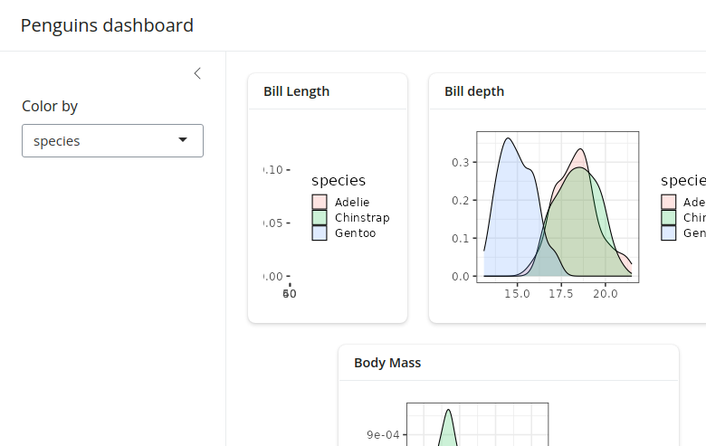

# bslib

The `bslib` R package provides a modern UI toolkit for Shiny and R Markdown based on Bootstrap. It facilitates:

- Creation of delightful and customizable Shiny dashboards.   
- UI components (e.g., cards, value boxes, sidebars, etc).   
- Custom theming of Shiny apps.   

```{r eval=F}
install.packages("bslib")
```

```{r echo=F,fig.cap="Example of a bslib dashboard"}
knitr::include_graphics("images/bslib_ex.png")
```

## Fundamentals

### Content filling {-} {#filling}

filling layout, meaning that outputs are encouraged to grow/shrink to fit the browser window

https://rstudio.github.io/bslib/articles/filling/index.html

https://rstudio.github.io/bslib/articles/dashboards/index.html#scrolling-vs-filling

### Pages {-}

### Cards {-}

## Themes

### Bootswatch themes

[Bootswatch](https://bootswatch.com/) themes are pre-packaged themes that can be applied using `bslib::bs_theme()`. Apply them easily within your UI code:

``` {r eval=F}
bslib::page_sidebar(
  theme = bslib::bs_theme(bootswatch = "minty")
)
```

[Read more!](https://rstudio.github.io/bslib/articles/theming/index.html#bootswatch)

### Main colours and fonts

Sometimes you may want to have a customized theme. This is also easy to set up using `bslib::bs_theme()` by setting the background colour (`bg`), foreground colour (`fg`), accent colours (`primary`, `secondary`, etc) and fonts (`base_font`, `heading_font`, `code_font`, etc).

```  {r eval=F}
page_sidebar(
  title = "My app",
  bs_theme(
    bg = "#101010",
    fg = "#FFF",
    primary = "#E69F00",
    secondary = "#0072B2",
    success = "#009E73",
    base_font = font_google("Inter"),
    code_font = font_google("JetBrains Mono")
  ),
  ...
)
```

[Read more!](https://rstudio.github.io/bslib/articles/theming/index.html#main-colors)

### Additional theming tools

Beyond the pre-packaged themes and customizing colours and fonts there are other tools we can use for theming. These are less important and more niche, so we won't dive in here.

- [Theming variables](https://rstudio.github.io/bslib/articles/theming/index.html#theming-variables): More targeted theming of certain elements.   
- [Adding rules](https://rstudio.github.io/bslib/articles/theming/index.html#add-rules): Add css files or additional css rules directly in `bs_theme`.
- [Utility classes](https://rstudio.github.io/bslib/articles/utility-classes/index.html): Adding css directly to shiny UI components like buttons, tabs, etc.   
- [Component support](https://rstudio.github.io/bslib/articles/custom-components/index.html): Creating custom HTML components using `sass`.     
- [Dynamic theming](https://rstudio.github.io/bslib/articles/theming/index.html#dynamic): Real-time theming like dark mode toggling.      

## Layouts

### Multi-column

#### `bslib::layout_columns()`

Create column layouts easily using `bslib::layout_columns()`. Optional arguments include:

- `col_widths` which go up to 12 for each row. Beyond 12 cards will wrap to the next row. Negative values create an empty space. If not specified widths will be equally split.
- `row_heights` Numeric inputs are fractional units but fixed units are supported too. If not specified widths will be equal.

``` {r eval=F}
ui <- bslib::page_sidebar(
  bslib::layout_columns(
    col_widths = c(4, 8, -2, 8, -2),
    row_heights = c(1, 2),
    bslib::card(),
    bslib::card(),
    bslib::card()
  )
)
```

```{r echo=F,fig.cap="Example of bslib::layout_columns()"}

```

[Read more!](https://rstudio.github.io/bslib/articles/dashboards/index.html#multi-column)

#### `bslib::layout_column_wrap()` {#col-wrap}

When displaying multiple cards (or value boxes, etc) at once, it’s often most visually appealing to have them displayed in a grid-like layout where each card has the same height and width. This is the core principle of `bslib::layout_column_wrap()`, instead of specifying every column's width and every row's height like `bslib::layout_columns()`, we will give a width and height to apply to every card.

[Read more!](https://rstudio.github.io/bslib/articles/column-layout/index.html)

##### Fixed columns {.unnumbered}

Provide the width as `width = 1/n` where `n` is the number of columns. Columns will adjust to the window size to maintain the 1/n width:

``` {r eval=F}
bslib::layout_column_wrap(
  width = 1/2, 
  height = 300,
  bslib::card(),
  bslib::card(),
  bslib::card()
)
```

[Read more!](https://rstudio.github.io/bslib/articles/column-layout/index.html#fixed-number-of-columns)

##### Responsive number of columns {.unnumbered}

Provide the width in any valid CSS unit like `200px`. In this case, a two card layout will wrap to a new row when the window is less than 400 pixels wide (200px * 2 cards); beyond 400 pixels the cards will widen to equally fill the space:

``` {r eval=F}
bslib::layout_column_wrap(
  width = '200px', 
  height = 300,
  bslib::card(),
  bslib::card(),
  bslib::card()
)
```

[Read more!](https://rstudio.github.io/bslib/articles/column-layout/index.html#responsive-number-of-columns)

##### Fixed column width {.unnumbered}

If you don't want cards to fill the free space if the window goes beyond the total width of your cards then set the argument `fixed_width = TRUE`:

``` {r eval=F}
bslib::layout_column_wrap(
  width = '200px', 
  height = 300,
  fixed_width = TRUE,
  bslib::card(),
  bslib::card(),
  bslib::card()
)
```

[Read more!](https://rstudio.github.io/bslib/articles/column-layout/index.html#fixed-column-width)

##### Varying heights by row {.unnumbered}

The default is to have all row heights equal. However, you can also allow row heights to be different set `heights_equal = "row"`:

``` {r eval=F}
bslib::layout_column_wrap(
  width = "200px",
  heights_equal = "row",
  bslib::card(),
  bslib::card(),
  bslib::card()
)
```

[Read more!](https://rstudio.github.io/bslib/articles/column-layout/index.html#by-row)

##### Varying heights by cell {.unnumbered}

Cards are considered 'fill items', which means they will adapt to fill space by default. This means that if one card has less content than the other cards in the row, it will still expand to fill that empty space. However, you can prevent this by specifying `fill = FALSE` in specific cards:

``` {r eval=F}
bslib::layout_column_wrap(
  width = "200px",
  bslib::card(),
  bslib::card(),
  bslib::card(
    fill = FALSE, #Here it is!!!
    card_header("Nothing much here"),
    "This is it."
  )
)
```

[Read more!](https://rstudio.github.io/bslib/articles/column-layout/index.html#by-cell)

##### Varying widths {.unnumbered}

If you still want specific cards to have different widths but you want the functionality of wrapping, you can set the `width` to `NULL` and provide a custom css grid layout like so:

``` {r eval=F}
bslib::layout_column_wrap(
  width = NULL, 
  height = 300, 
  fill = FALSE,
  style = css(grid_template_columns = "2fr 1fr 2fr"), #second card has half the width as the other two
  bslib::card(),
  bslib::card(),
  bslib::card()
)
```

[Read more!](https://rstudio.github.io/bslib/articles/column-layout/index.html#varying-widths)

##### Nested layouts {.unnumbered}

You can also nest `layout_column_wrap()` within another `layout_column_wrap()` to create unique layouts. For example:

``` {r eval=F}
bslib::layout_column_wrap(
  width = 1/2,
  height = 300,
  bslib::card(),
  bslib::layout_column_wrap(
    width = 1,
    heights_equal = "row",
  bslib::bslib::card(),
  bslib::bslib::card()
  )
)
```

[Read more!](https://rstudio.github.io/bslib/articles/column-layout/index.html#nested-layouts)

### Multi-page

To create multiple pages (or tabs) you can use `bslib::page_navbar()`, where you can set the `sidebar` argument if you want a sidebar, as well as add pages (tabs) by calling `bslib::nav_panel()`. Beyond a sidebar and tabs you can also create additional space between elements on the tab bar using `bslib::nav_spacer()` and even add links using `bslib::nav_item()`.

``` {r eval=F}
bslib::page_navbar(
  title = "Interesting title",
  sidebar = bslib::sidebar(),
  bslib::nav_spacer(),
  bslib::nav_panel(
    "Tab 1", 
    bslib::card()
  ),
  bslib::nav_panel(
    "Tab 2", 
    bslib::card()
  ),
  bslib::nav_panel(
    "Tab 3", 
    bslib::card()
  ),
  bslib::nav_item(
    htmltools::tags$a(
      "Title", 
      href = "https://myurl.com"
    )
  )
)
```

[Read more!](https://rstudio.github.io/bslib/articles/dashboards/index.html#multi-page)

### Multi-panel {#multi-panel}

Not only can we use tabs at the page level using `bslib::page_sidebar()`, we can also create them using any `bslib::navset_*()`. These are built to be outside the context of cards, but there are also some that create tabbed cards following the format of `bslib::navset_card_*()`. Check all of the options [here](https://rstudio.github.io/bslib/reference/navset.html#details).

[Read more!](https://rstudio.github.io/bslib/articles/dashboards/index.html#multi-panel)

### Scrolling vs filling

Both `bslib::page_sidebar()` and `bslib::page_navbar()` default to a filling layout (see Section \@ref(filling). Sometimes this results in undesireable behaviour, you can combat this by setting `bslib::card()` heights using `min_height` to restrict how small a card gets or `max_height` to restrict how large a card will get:

``` {r eval=F}
bslib::page_sidebar(
  title = "Title",
  bslib::sidebar = bslib::sidebar(),
  bslib::card(
    min_height = 200
  ),
  bslib::card(
    max_height = 200
  )
)
```

Even further, you may not want the filling layout at all. To stop this you can set `fillable = FALSE` which will default outputs to 400px (or whatever height you have specified) and will make the whole page scrollable instead:

``` {r eval=F}
bslib::page_sidebar(
  title = "Penguins dashboard",
  bslib::sidebar = bslib::sidebar(),
  fillable = FALSE,
  bslib::card()
)
```

[Read more!](https://rstudio.github.io/bslib/articles/dashboards/index.html#scrolling-vs-filling)

### Mobile layout

Filling layout for mobile devices is defaulted to `FALSE`. You can enable it by setting `fillable_mobile = TRUE` at the page level. You will want to set `min_height` for cards to prevent too much shrinkage.

[Read more!](https://rstudio.github.io/bslib/articles/dashboards/index.html#mobile-layout)

## Cards

A `bslib::card()` is designed to handle any number of “known” card items (e.g., `card_header()`, `card_body()`, etc) as unnamed arguments (i.e., children). As we’ll see shortly, `card()` also has some useful named arguments (e.g., `full_screen`, `height`, etc).

### Card components {-}

The `bslib::card_header()` is where you can place contents in a header. This is a great place for your title and any icons!

The `bslib::card_body()` is where you can place your main card contents. If you find yourself using `bslib::card_body()` without changing any of its defaults, consider dropping it altogether since it will be wrapped together into an implicit `card_body()` call anyways.

The `bslib::card_footer()` is where you can place contents in a footer. This is a great place for any tooltips or popovers (see section \@ref(tips-popovers))

### Restricting growth {-}

By default, a `card()`’s size grows to accommodate the size of its contents. Thus, if a `card_body()` contains a large amount of text, tables, etc., you may want to specify a `height` or `max_height`. That said, when laying out multiple cards, it’s likely best not to specify `height` on the `card()`, and instead, let the layout determine the height `layout_column_wrap()`.

### Scrolling {-}

Although scrolling is convenient for reducing the amount of space required to park lots of content, it can also be a nuisance to the user. When the contents of a card go beyond the height of the screen `bslib` will automatically create a scroll bar for the card. To help reduce the need for scrolling, consider pairing scrolling with `full_screen = TRUE` (which adds an icon to expand the card’s size to the browser window)

### Filling outputs {-}

A `card()`’s default behavior is optimized for facilitating filling layouts. More specifically, if a fill item (e.g., plotly_widget), appears as a direct child of a `card_body()`, it resizes to fit the `card()`s specified height

Fill item(s) aren’t limited in how much they grow and shrink, which can be problematic when a card becomes very small. To work around this, consider adding a `min_height` on the `card_body()` container.

``` {r eval=F}
card(
  height = 300,
  style = "resize:vertical;",
  card_header("Plots that grow but don't shrink"),
  card_body(
    min_height = 250,
    plotly_widget,
    plotly_widget
  )
)
```

### Other features {-}

There is a ton of functionality for cards that we don't necessarily need to dive deep on. These include:

- **Multiple card bodies:** You can also set up a card with multiple card bodies, which is useful for when you want a fillable item with a non fillable item or to have unique stylings. [Read more!](https://rstudio.github.io/bslib/articles/cards/index.html#multiple-card_body)   
- **Multiple columns:** Sometimes you may want multiple columns in your card, for this you can use `bslib::layout_column_wrap()` within a card body to format the layout of your outputs. [Read more!](https://rstudio.github.io/bslib/articles/cards/index.html#multiple-columns)   
- **Multiple cards:** Again, as discussed in section \@ref(col-wrap) using `bslib::layout_column_wrap()` can also help format the layout of multiple cards. [Read more!](https://rstudio.github.io/bslib/articles/cards/index.html#multiple-cards)   
- **Multiple tabs:** We have already discussed tabs in section \@ref(multi-panel), these can be useful within cards themselves. [Read more!](https://rstudio.github.io/bslib/articles/cards/index.html#multiple-tabs)   
- **Sidebars:** You can also create sidebars within a card using `bslib::layout_sidebar()`. [Read more!](https://rstudio.github.io/bslib/articles/dashboards/index.html#cards-with-sidebars) and [Read even more!](https://rstudio.github.io/bslib/articles/cards/index.html#sidebars)   
- **Static images:** You can also embed static images! [Read more!](https://rstudio.github.io/bslib/articles/cards/index.html#static-images)   
- **Flexbox:** Cards are all fillable because they are CSS flexbox containers. This means when you have inline tags (html tags) there is weird behaviour where each tag will appear on a new line. However, if you set `fillabe = FALSE` they will render inline. [Read more!](https://rstudio.github.io/bslib/articles/cards/index.html#flexbox)   

## Sidebars

### Floating layout {-}

Easily create a floating layout with a sidebar using `bslib::layout_sidebar()`. This will align nicely with the main contents or can even be placed inside cards.

``` {r eval=F}
bslib::layout_sidebar(
  sidebar = sidebar("Sidebar"),
  "Main contents"
)
```

[Read more!](https://rstudio.github.io/bslib/articles/sidebars/index.html#floating-layout)

### Filling layout {-}

If you prefer to have a sidebar that extends the whole length of the page then make sure you nest your `bslib::layout_sidebar()` inside of a `bslib::page_fillage()` function.

``` {r eval=F}
bslib::page_fillable(
  bslib::layout_sidebar(
    sidebar = sidebar("Sidebar area"),
    "Main area"
  )
)
```

[Read more!](https://rstudio.github.io/bslib/articles/sidebars/index.html#filling-layout)

### Multi-page layout {-}

If you want to use a single sidebar for multiple pages of an app you want to use the `sidebar` argument that is found in `bslib::page_navbar()` or `bslib::navset_card_tab()`.

``` {r eval=F}
bslib::page_navbar(
  sidebar = sidebar("Sidebar"),
  nav_panel("Page 1", "Page 1 content"),
  nav_panel("Page 2", "Page 2 content")
)
```

::::{.tipbox}
:::{.center}
**TIP**
:::
This is one of the best options for setting up a sidebar.
::::

[Read more!](https://rstudio.github.io/bslib/articles/sidebars/index.html#multi-page-layout)

### Conditional and reactive updates {-}

Sometimes we want to have conditional contents in the sidebar that are based on the page/tab that has been selected. We can use `bslib::conditionalPanel()` inside of the `sidebar` argument in `bslib::page_navbar()`/`bslib::navset_card_tab()`/`navset_tab_pill()`. We just have to provide an `id` that we can reference in the `bslib::conditionalPanel()`: 

``` {r eval=F}
shinyApp(
  page_navbar(
    title = "Conditional sidebar",
    id = "nav",
    sidebar = sidebar(
      conditionalPanel(
        "input.nav === 'Page 1'",
        "Page 1 sidebar"
      ),
      conditionalPanel(
        "input.nav === 'Page 2'",
        "Page 2 sidebar"
      )
    ),
    nav_panel("Page 1", "Page 1 contents"),
    nav_panel("Page 2", "Page 2 contents")
  ),
  server = function(...) {
    # no server logic required
  }
)
```

We can also set the sidebar to open up one specific pages:

```{r eval=F}
ui <- page_navbar(
  title = "Sidebar updates",
  id = "nav", #the ID to reference in server
  sidebar = sidebar(
    id = "sidebar", #set the sidebar ID
    open = FALSE,
    "Sidebar"
  ),
  nav_panel(
    "Page 1", #the name of the nav page
    "Sidebar closed. Go to Page 2 to open."
    ),
  nav_panel(
    "Page 2", 
    "Sidebar open. Go to Page 1 to close."
    )
)

server <- function(input, output) {
  observe({
    sidebar_toggle( #the server toggle
      id = "sidebar", #the sidebar ID
      open = input$nav == "Page 2" #open when on page 2
    )
  })
}
```

::::{.tipbox}
:::{.center}
**TIP**
:::
This is useful if certain filters are only applicable to certain pages.
::::

[Read more!](https://rstudio.github.io/bslib/articles/sidebars/index.html#conditional-contents)   
[Read even more!](https://rstudio.github.io/bslib/articles/sidebars/index.html#reactive-updates)

### Accordions {-}

Within a sidebar the `bslib::accordion()` will be flush to the sidebar and is an easy way to group input controls in a drop-down style.

[Read more!](https://rstudio.github.io/bslib/articles/dashboards/index.html#accordions)

### Nested sidebars {-}

If you want to get wild and have nested sidebars go for it!

[Read more!](https://rstudio.github.io/bslib/articles/sidebars/index.html#nested-sidebars)

### Styling {-}

There are a handful of other arguments to further customize the look and feel if the sidebar layout. They allow for a specific background color (via bg), which is applied to the sidebar area and main content area respectively.

[Read more!](https://rstudio.github.io/bslib/articles/sidebars/index.html#styling-and-customization)

## Value boxes

A `bslib::value_box()` is a special kind of card designed for highlighting a value along with a title and a showcase placeholder (typically a [bsicons](https://github.com/rstudio/bsicons) icon). You can even have a plot as a backdrop to the value showcase.

```{r echo=F,fig.cap="An example of a value box."}
knitr::include_graphics("images/value_box.png")
```

[Read more!](https://rstudio.github.io/bslib/articles/value-boxes/index.html)

## Tooltips and Popovers {#tips-popovers}

Tooltips and popovers are useful for displaying information in a convenient and non-obtrusive way. Both require a trigger and a message. Tooltips are toggled via focus / hover whereas popovers are toggled via click. There is a lot of functionality with tooltips and popovers, above are some of the main usages but you can read more [here](https://rstudio.github.io/bslib/articles/tooltips-popovers/index.html).

``` {r eval=F}
#Tooltip example
actionButton(
  "btn_tip",
  "Focus/hover here for tooltip"
) |>
  tooltip("Tooltip message")

#Popover example
actionButton(
  "btn_pop", 
  "Click here for popover"
) |>
  popover(
    "Popover message",
    title = "Popover title"
  )
```

You can make the text itself the trigger by using `htmltools::span()`:

``` {r eval=F}
bslib::tooltip(
  htmltools::span(
    "This text does trigger"
  ),
  "Tooltip message",
  placement = "bottom"
)
```

Also, you can easily add icons using the `htmltools::span()` function and the `bsicons` package!

``` {r eval=F}
htmltools::span(
  "This text doesn't trigger",
  bslib::tooltip(
    bsicons::bs_icon("info-circle"),
    "Tooltip message",
    placement = "bottom"
  )
)
```

A great place is to use them alongside input labels like so:

``` {r eval=F}
bslib::textInput(
  "txt",
  label = bslib::tooltip(
    trigger = list(
      "Input label",
      bsicons::bs_icon("info-circle")
    ),
    "Tooltip message"
  )
)
```

or even card headers!

``` {r eval=F}
bslib::card(
  bslib::card_header(
    "Card header",
    bslib::tooltip(
      bsicons::bs_icon("info-circle"),
      "Tooltip message"
    )
  ),
  "Card body..."
)
```

::::{.tipbox}
:::{.center}
**TIP**
:::
Popovers are much more “persistent” (i.e., harder to open/close), and thus should only be used over tooltips when further interaction may be needed. To put it another way, use tooltips for small “read-only” messages, and popovers when the user should be able to interact with the message itself.
::::

## Using Shiny Info

Because we are still using shiny as a base, we can use useful tools like `getCurrentOutputInfo()` to drive behaviour on the server side. For example, adding new labels or plots when a window meets a certain size.

``` {r eval=F}
server <- function(input, output, session) {
  output$plot_id <- renderPlot({
    info <- getCurrentOutputInfo()
    if (info$height() > 600) {
      # code for "large" plot
    } else {
      # code for "small" plot
    }
  })
}
```

::::{.notebox}
:::{.center}
**NOTE**
:::
This is probably the most advanced you can get with `shiny` and `bslib`. When you begin to work with things at this level you will need to learn how to use things like `browser()` and inspecting the shiny web-page. This is a bit beyond what we are going to cover here.
::::

[Read more!](https://rstudio.github.io/bslib/articles/cards/index.html#shiny)

## Basic Example with `bslib`

## Additional Resources

- [bslib Manual](https://rstudio.github.io/bslib/index.html)
